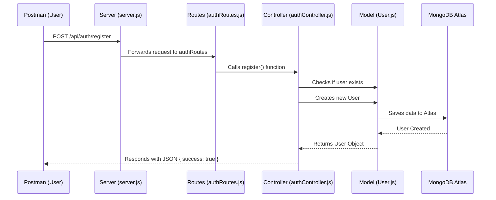

# Understanding the Microservices & Monorepo Structure

Macha, since you are new to this, let's break down exactly **how the folder structure works** and **how the code flows** when a user tries to Register or Login.

## 1. The Structure (Monorepo)
In a normal project, everything is in one folder. In a **Monorepo**, we split things into logical groups: `apps` and `packages`.

-   **`apps/`**: Contains the actual **Applications** (Services) that run.
    -   `auth-service`: Handles Login/Register.
    -   `gateway`: (Future) The main entry point.
    -   `frontend`: The React UI.
-   **`packages/`**: Contains **Shared Code** used by multiple apps. service specific code should not be here.
    -   `database`: The MongoDB connection logic (used by *all* backend services).
    -   `utils`: Helper functions like `formatResponse` (used by *all* backend services).

**Why do this?**
If you fix a bug in `formatResponse` inside `packages/utils`, it is automatically fixed for **Auth Service**, **Attendance Service**, and **Payroll Service** at the same time! You don't verify code duplication.

---

## 2. The Authentication Code Flow (Request to Response)

Let's trace what happens when you hit **POST /register**.



### Step-by-Step Code Walkthrough

#### Step 1: Entry Point (`apps/auth-service/server.js`)
This is the "Main Door".
```javascript
// It sees the request come to /api/auth
app.use('/api/auth', authRoutes);
```
It says: "Any request starting with `/api/auth`, go to the **Routes** file."

#### Step 2: The Router (`apps/auth-service/routes/authRoutes.js`)
This is the "Receptionist". It directs traffic.
```javascript
// It sees "POST /register"
router.post('/register', register);
```
It says: "Oh, you want to `/register`? Go to the **register connection** in the Controller."

#### Step 3: The Controller (`apps/auth-service/controllers/authController.js`)
This is the "Brain". It does the actual work.
```javascript
exports.register = async (req, res) => {
  // 1. Get data from user
  const { name, email, password } = req.body;

  // 2. Check if user already exists (using Model)
  const userExists = await User.findOne({ email });

  // 3. Create new User (using Model)
  const user = await User.create({ name, email, password });

  // 4. Send response back
  formatResponse(res, 201, 'User registered successfully');
};
```

#### Step 4: The Model (`apps/auth-service/models/User.js`)
This is the "Data Sctructure".
```javascript
const userSchema = new mongoose.Schema({ ... });
```
It defines **what a User looks like** (Name, Email, Password, Role) before saving to MongoDB.

#### Step 5: Shared Utils (`packages/utils/index.js`)
This is the "Helper".
```javascript
const formatResponse = (res, statusCode, message, data) => {
  // Standard way to reply to Frontend
  res.status(statusCode).json({ success: true, message, data });
};
```
We use this so **every API response looks exactly the same** across the entire project.

---

## Summary
1.  **Request** hits `server.js`.
2.  `server.js` sends it to `authRoutes.js`.
3.  `authRoutes.js` calls `authController.js`.
4.  `authController.js` talks to MongoDB via `User.js`.
5.  `authController.js` uses `utils` to send the **Response** back.

This separation makes your code **Professional**, **Scalable**, and **Neat**.
